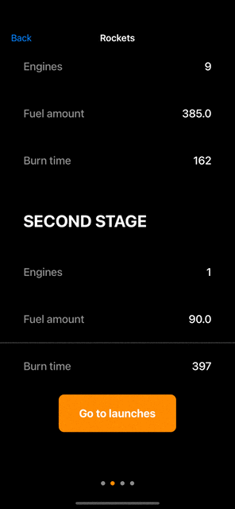

<h1 align="center">SpaceX Rockets</h1>

# Stack of technologies

* Swift
* UIKit
* MVVM
* UserDefaults

## This app has several features:
* List of SpaceX Rockets
* Every rocket technical characters 
* List of launches
* Settings for change physical units
* Launchpads and landingpads marks on Google Map

# Overview

<table>
    <thead>
        <tr>
            <th>Main Screen</th>
            <th>Page Control</th>
        </tr>
    </thead>
    <tbody>
        <tr>
            <td>
                
            </td>
            <td>
                
            </td>
        </tr>
    </tbody>
</table>

<table>
    <thead>
        <tr>
            <th>Settings</th>
            <th>Launches</th>
        </tr>
    </thead>
    <tbody>
        <tr>
            <td>
                
            </td>
            <td>
                
            </td>
        </tr>
    </tbody>
</table>
